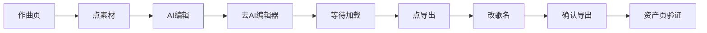

# 导出到资产页操作手册

> **确认流程**：作曲页 → 素材列表 → AI编辑 → AI编辑器 → 导出 → 确认导出 → 资产页

---

## 流程（7步已验证）



## 关键选择器（已验证 13/13 成功率）

| 步骤 | 选择器 | 类名 | 注意 |
|------|--------|------|------|
| 素材列表 | `//div[contains(@class,"libraryItemWrapper") and contains(.,"歌名")]` | `libraryItemWrapper-QRMdov` | 需等 12s+4s 渲染 |
| AI 编辑按钮 | `button[class*="aiEditButton"]` | `aiEditButton-BxDygS` | 非 Semi 按钮 |
| 去AI编辑器 | `button[class*="primaryBtn"]` | `primaryBtn-gl7Q_G` | 滚动可见再点 |
| 导出按钮 | `button.semi-button-secondary` + text="导出" | `semi-button-secondary` | 需全事件链触发 |
| 确认导出 | `button.semi-button` + text包含"导出"/"并轨导出" | `semi-button-primary` | |
| 歌名input | `querySelectorAll('input')` + value="新项目" | Semi UI组件 | disabled → 先改状态 |

## 脚本命令

```bash
cd ~/.hermes/auto-douyinmusic
source .venv/bin/activate
python export_v5.py <歌名>
```

## 关键时序

| 事件 | 等待时间 | 说明 |
|------|---------|------|
| 素材列表渲染 | 12s | 导航到 /studio/create 后 |
| 滚动到底部 | +4s | titleRow 才出现 |
| 编辑器加载 | 10-15s | 音频波形加载完成后导出按钮才可用 |
| 导出弹窗出现 | 3s | 点导出后等弹窗渲染 |

## 踩坑索引

1. `dispatchEvent` 返回 None ≠ 失败 — 用 UI 变化判断
2. 歌名 input 是 disabled 的 → 先 `disabled=false` 再 `removeAttribute('disabled')`
3. 点导出按钮须用 mousedown+mouseup+click 全事件链（React 绑定在 button 上，不在 span 内层）
4. beforeunload 弹窗阻塞 → `window.onbeforeunload=null;window.alert=function(){}`
